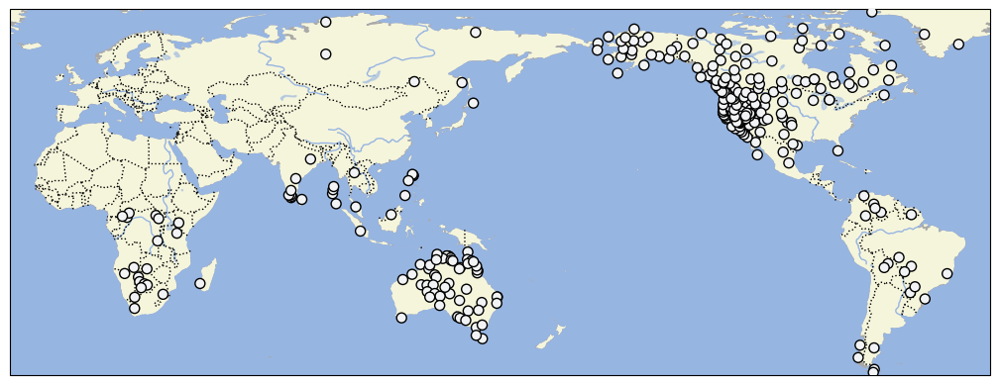

# D-PLACE dataset derived from Binford 2001 'Constructing Frames of Reference'

## How to cite

If you use these data please cite
- the original source
  > Binford, L. 2001. Constructing Frames of Reference: An Analytical Method for Archaeological Theory Building Using Hunter-gatherer and Environmental Data Sets. University of California Press
- the derived dataset using the DOI of the [particular released version](../../releases/) you were using

## Description

The Binford Hunter-Gatherer dataset describes cultural practices for 339 hunter-gatherer groups. Approximately two-thirds of the societies described by Binford are also described in the Ethnographic Atlas. However, the Binford database includes a number of societies not in the Ethnographic Atlas, including many in Australia and northern North America.

This dataset is licensed under a CC-BY-NC-4.0 license

## CLDF Datasets

The following CLDF datasets are available in [cldf](cldf):

- CLDF [StructureDataset](https://github.com/cldf/cldf/tree/master/modules/StructureDataset) at [cldf/StructureDataset-metadata.json](cldf/StructureDataset-metadata.json)